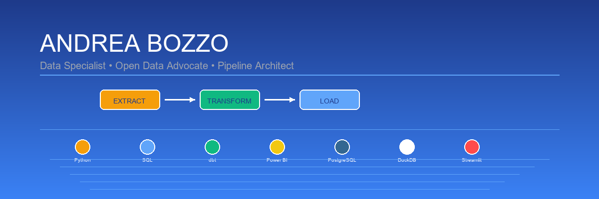

# 👋 Andrea Bozzo

<p align="center">
  
</p>

<p align="center">
  <strong>Data Engineer | Open Data Advocate | Analytics Pipeline Architect</strong><br>
  Transforming public data into accessible insights. Building scalable data solutions with open-source tools.
</p>

<p align="center">
  <a href="https://github.com/sponsors/AndreaBozzo">
    
  </a>
  
</p>

<p align="center">
  <a href="#-progetto-spotlight">Spotlight</a> •
  <a href="#-stack-tecnico">Stack</a> •
  <a href="#-progetti">Progetti</a> •
  <a href="#-filosofia">Filosofia</a> •
  <a href="#-connect">Connect</a>
</p>

---

## 🔦 Featured Project

### 🔭 [Osservatorio](https://github.com/AndreaBozzo/Osservatorio) - *Open Data Analytics Platform*

<p align="center">
  
  
  
  
  
</p>

**Osservatorio** democratizes access to Italian statistical data through automated pipelines and intuitive visualizations. **Growing community with 4+ active contributors** and production-ready infrastructure.

#### ✨ Key Features
- **Robust ETL pipelines** for ISTAT data with automatic retries and circuit breakers
- **Interactive Streamlit dashboards** for demographic and socio-economic analysis  
- **Multi-format export** (CSV, Excel, Parquet) for maximum interoperability
- **Contributor-friendly architecture** with complete documentation and 57+ test coverage
- **Active community** with regular discussions and collaborative development

#### 🚀 Current Focus: Advanced Analytics Layer
Implementing hybrid persistence (DuckDB + PostgreSQL) for <100ms analytics queries. **Seeking contributors for data modeling and performance optimization.** [Join the discussion →](https://github.com/AndreaBozzo/Osservatorio/discussions)

---

## 🛠️ Stack Tecnico

### Core Technologies
```python
data_stack = {
    "orchestration": ["dbt-core", "Python 3.11+", "Poetry"],
    "storage": ["DuckDB", "PostgreSQL", "Parquet"],
    "analytics": ["pandas", "numpy", "streamlit"],
    "visualization": ["Power BI", "Plotly", "Excel"],
    "philosophy": "No vendor lock-in, 100% reproducible"
}
```

### 📊 Skills Progress

#### Data Engineering


#### Analytics & BI


#### Cloud & DevOps


### Competenze Distintive
- **Data Modeling**: Architetture multi-layer (`staging → core → marts`)
- **Pipeline Design**: ETL/ELT con validazioni integrate e audit trails
- **API Integration**: Parsing SDMX, JSON, XML da fonti governative
- **Performance**: Query optimization, caching strategies, async processing

---

## 📂 Altri Progetti

<table>
<tr>
<td width="33%">

### 🧊 [Mini-Lakehouse-Didattico](https://github.com/AndreaBozzo/Mini-Lakehouse-Didattico)
**Modern Data Stack in miniatura**


- dbt + DuckDB per analytics velocissime
- Testing automatizzato con `dbt-expectations`
- Template pronto per progetti reali

</td>
<td width="33%">

### 📊 [CruscottoPMI](https://github.com/AndreaBozzo/CruscottoPMI)
**Business Intelligence per PMI**


- Dashboard finanziarie con Streamlit
- Integrazione XBRL per bilanci
- KPI automatizzati e what-if analysis

</td>
<td width="33%">

### 📈 [DashboardsBI-Excel](https://github.com/AndreaBozzo/DashboardsBI-Excel)
**Template Excel avanzati per BI**


- Dashboard dinamiche con Power Query
- Calcoli di bilancio e analisi what-if
- Report parametrici multi-settore

</td>
</tr>
</table>

---

## 💡 Filosofia di Lavoro

> **"I dati pubblici appartengono a tutti, devono essere accessibili a tutti"**

### Principi Guida
- 🔍 **Trasparenza**: Ogni trasformazione tracciabile e documentata
- 🚀 **Performance**: Se non è veloce, non è finito
- 🧪 **Qualità**: Test first, debug later
- 🌍 **Openness**: Nessun vendor lock-in, massima portabilità

---

## 📊 GitHub Activity

<p align="center">
  
  
</p>

<p align="center">
  
</p>

### 🏆 Quick Stats
- 📈 **Public Repositories**: Focus su data engineering e analytics
- 🔥 **Recent Activity**: Pipeline ETL automatizzate e dashboard interattive
- 💡 **Open Source**: Contributi alla community data italiana
- 🎯 **Specialization**: 85% Python, SQL, Power BI

---

## 🤝 Let's Connect & Collaborate

<p align="center">
  <a href="https://github.com/sponsors/AndreaBozzo">
    
  </a>
  <a href="https://github.com/AndreaBozzo/Osservatorio/discussions">
    
  </a>
  <a href="https://www.linkedin.com/in/andrea-bozzo-/">
    
  </a>
  <a href="mailto:andreabozzo92@gmail.com">
    
  </a>
</p>

### 💼 Open to Professional Opportunities:
- **Consulting** on data engineering and analytics architecture
- **Collaborations** on open data initiatives and public sector projects
- **Speaking engagements** on democratizing data access
- **Mentoring** junior data professionals

### 🎯 Currently Seeking:
- **Contributors** for Osservatorio project expansion
- **Data partnerships** with Italian public institutions
- **Open source maintainers** for knowledge sharing

---

<p align="center">
  <sub>🚀 Building scalable data infrastructure • 🌍 Democratizing public data access • 💡 Open source advocate</sub><br>
  <sub><strong>Supported by GitHub Sponsors</strong> • <em>Available for consulting and collaboration</em></sub>
</p>
