# 👋 Andrea Bozzo

  <strong>Senior Data Architect | Systems Programmer | Open Source Creator</strong> 

  My path into technology wasn't a straight line, but an inevitable evolution. I've spent my life as a problem-solver, and with a keyboard in front of me for as long as I can remember, programming became my natural language for building solutions.  
  This journey took me from a background as a Chartered Accountant, through data analysis, and ultimately deep into systems engineering. On my blog, I share technical deep-dives into the projects I contribute to.

  Expect complex jargon and unfiltered details as it's written for fellow <del>nerds</del> builders.

  I have a few personal projects like <a href="https://github.com/AndreaBozzo/Ceres">Ceres</a>, free templates for BI,
  hands on starter implementations of Kafka, Flink, PostgreSQL / DuckDB, analytics notebooks and generally useful content for anyone working with data. 
  Leave a ⭐ if you find any of these useful, they are all on free licences.

  Thank you ❤️

  <a href="https://andreabozzo.github.io/AndreaBozzo/">🌐 Landing Page</a> •
  <a href="https://andreabozzo.pages.dev/">📝 Blog</a> •
  <a href="https://www.linkedin.com/in/andrea-bozzo-/">💼 LinkedIn</a> •
  <a href="mailto:andreabozzo92@gmail.com">📧 Email</a>

  

---

## 🛠️ Tech Stack

  <table>
    <tr>
      <td align="center"><strong>Core Languages</strong></td>
      <td></td>
      <td></td>
    </tr>
    <tr>
      <td align="center"><strong>Data & Architecture</strong></td>
      <td></td>
      <td></td>
      <td></td>
    </tr>
    <tr>
      <td align="center"><strong>Cloud & DevOps</strong></td>
      <td></td>
      <td></td>
      <td></td>
    </tr>
  </table>

---

## 🌟 Open Source Contributions

Contributing to the broader open source ecosystem beyond my own projects.

> *This section is automatically updated daily via GitHub Actions*

<!-- EXTERNAL_CONTRIBUTIONS:START -->
### 🔬 Data Ecosystem

| Project | Stars | PRs | Description |
|---------|-------|-----|-------------|
| [pola-rs/polars](https://github.com/pola-rs/polars) | 36.9k | 3 | Extremely fast Query Engine for DataFrames, written in Rust |
| [risingwavelabs/risingwave](https://github.com/risingwavelabs/risingwave) | 8.7k | 1 | Event streaming platform for agents, apps, and analytics.... |
| [supabase/etl](https://github.com/supabase/etl) | 2.1k | 2 | Stream your Postgres data anywhere in real-time. Simple Rust... |
| [lakekeeper/lakekeeper](https://github.com/lakekeeper/lakekeeper) | 1.1k | 2 | Lakekeeper is an Apache-Licensed, secure, fast and easy to... |
| [pganalyze/pg_query.rs](https://github.com/pganalyze/pg_query.rs) | 210 | 1 | Parse, deparse and normalize SQL queries using the Postgres... |
| [apache/fluss-rust](https://github.com/apache/fluss-rust) | 27 | 1 | Rust Client for Apache Fluss (Incubating) |

### 🦀 Rust Tooling

| Project | Stars | PRs | Description |
|---------|-------|-----|-------------|
| [tokio-rs/tokio](https://github.com/tokio-rs/tokio) | 30.7k | 1 | A runtime for writing reliable asynchronous applications with... |
| [apache/iceberg-rust](https://github.com/apache/iceberg-rust) | 1.2k | 2 | Apache Iceberg |
| [vakamo-labs/openfga-client](https://github.com/vakamo-labs/openfga-client) | 5 | 1 | OpenFGA Rust Client is a type-safe client for OpenFGA with... |
| [rust-ita/rust-docs-it](https://github.com/rust-ita/rust-docs-it) | 2 | 2 | Documentazione Rust tradotta in italiano |

### 🤖 AI/ML

| Project | Stars | PRs | Description |
|---------|-------|-----|-------------|
| [datapizza-labs/datapizza-ai](https://github.com/datapizza-labs/datapizza-ai) | 2.1k | 3 | Build reliable Gen AI solutions without overhead 🍕 |
| [mosaico-labs/mosaico](https://github.com/mosaico-labs/mosaico) | 287 | 10 | Mosaico is the open-source data platform for Robotics and... |

### 🛠️ Infrastructure

| Project | Stars | PRs | Description |
|---------|-------|-----|-------------|
| [mariocandela/beelzebub](https://github.com/mariocandela/beelzebub) | 1.8k | 1 | A secure low code honeypot framework, leveraging AI for... |
| [CortexFlow/CortexBrain](https://github.com/CortexFlow/CortexBrain) | 73 | 3 | CortexBrain is an ambitious open-source project designed to... |

### 📦 Other

| Project | Stars | PRs | Description |
|---------|-------|-----|-------------|
| [italia-opensource/awesome-italia-opensource](https://github.com/italia-opensource/awesome-italia-opensource) | 314 | 1 | Italian Open-Source is the first platform dedicated to... |
| [piopy/fantacalcio-py](https://github.com/piopy/fantacalcio-py) | 42 | 4 | Piccolo tool per guidarci all'asta spendendo poco |
| [informagico/fantavibe](https://github.com/informagico/fantavibe) | 3 | 1 | No description |
<!-- EXTERNAL_CONTRIBUTIONS:END -->

---

## 📊 GitHub Stats

  
  

  

