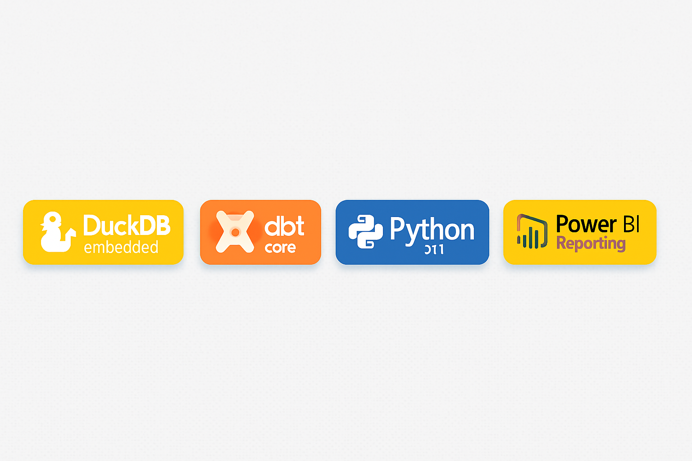

# 👋 Andrea Bozzo

<p align="center">
  
</p>

<p align="center">
  <strong>Data Engineer | Open Data Advocate | Pipeline Architect</strong><br>
  Trasformo dati pubblici in insight accessibili. Build locally, think openly.
</p>

<p align="center">
  <a href="#-progetto-spotlight">Spotlight</a> •
  <a href="#-stack-tecnico">Stack</a> •
  <a href="#-progetti">Progetti</a> •
  <a href="#-filosofia">Filosofia</a> •
  <a href="#-connect">Connect</a>
</p>

---

## 🔦 Progetto Spotlight

### 🔭 [Osservatorio](https://github.com/AndreaBozzo/Osservatorio) - *Open Data Analytics Platform*

<p align="center">
  
  
  
  
</p>

**Osservatorio** democratizza l'accesso ai dati statistici italiani attraverso pipeline automatizzate e visualizzazioni intuitive.

#### ✨ Key Features
- **Pipeline ETL robuste** per dati ISTAT con retry automatici e circuit breakers
- **Dashboard Streamlit** interattive per analisi demografiche e socio-economiche  
- **Export multi-formato** (CSV, Excel, Parquet) per massima interoperabilità
- **Architettura contributor-friendly** con docs complete e test coverage >50%

#### 🚀 Next: Database Layer (DuckDB + PostgreSQL)
Stiamo implementando persistenza ibrida per query analytics <100ms. [Contribuisci al progetto →](https://github.com/AndreaBozzo/Osservatorio/discussions)

---

## 🛠️ Stack Tecnico

### Core Technologies
```python
data_stack = {
    "orchestration": ["dbt-core", "Python 3.11+", "Poetry"],
    "storage": ["DuckDB", "PostgreSQL", "Parquet"],
    "analytics": ["pandas", "numpy", "streamlit"],
    "visualization": ["Power BI", "Plotly", "Excel"],
    "philosophy": "No vendor lock-in, 100% reproducible"
}
```

### Competenze Distintive
- **Data Modeling**: Architetture multi-layer (`staging → core → marts`)
- **Pipeline Design**: ETL/ELT con validazioni integrate e audit trails
- **API Integration**: Parsing SDMX, JSON, XML da fonti governative
- **Performance**: Query optimization, caching strategies, async processing

---

## 📂 Altri Progetti

<table>
<tr>
<td width="33%">

### 🧊 [Mini-Lakehouse-Didattico](https://github.com/AndreaBozzo/Mini-Lakehouse-Didattico)
**Modern Data Stack in miniatura**
- dbt + DuckDB per analytics velocissime
- Testing automatizzato con `dbt-expectations`
- Template pronto per progetti reali

</td>
<td width="33%">

### 📊 [CruscottoPMI](https://github.com/AndreaBozzo/CruscottoPMI)
**Business Intelligence per PMI**
- Dashboard finanziarie con Streamlit
- Integrazione XBRL per bilanci
- KPI automatizzati e what-if analysis

</td>
<td width="33%">

### 📈 [DashboardsBI-Excel](https://github.com/AndreaBozzo/DashboardsBI-Excel)
**Template Excel avanzati per BI**
- Dashboard dinamiche con Power Query
- Calcoli di bilancio e analisi what-if
- Report parametrici multi-settore

</td>
</tr>
</table>

---

## 💡 Filosofia di Lavoro

> **"I dati pubblici appartengono a tutti, devono essere accessibili a tutti"**

### Principi Guida
- 🔍 **Trasparenza**: Ogni trasformazione tracciabile e documentata
- 🚀 **Performance**: Se non è veloce, non è finito
- 🧪 **Qualità**: Test first, debug later
- 🌍 **Openness**: Nessun vendor lock-in, massima portabilità

---

## 📊 GitHub Activity

<p align="center">
  
  
</p>

<!-- Alternative se le stats non funzionano:
<p align="center">
  
</p>
-->

---

## 🤝 Let's Connect

<p align="center">
  <a href="https://github.com/AndreaBozzo/Osservatorio/discussions">
    
  </a>
  <a href="https://linkedin.com/in/andrea-bozzo">
    
  </a>
  <a href="mailto:andreabozzo92@gmail.com">
    
  </a>
</p>

### 🎯 Interessato a:
- Collaborazioni su progetti open data
- Data engineering challenges
- Democratizzazione dell'accesso ai dati pubblici

---

<p align="center">
  <sub>Building data pipelines that make sense • Turning public data into public knowledge</sub>
</p>
