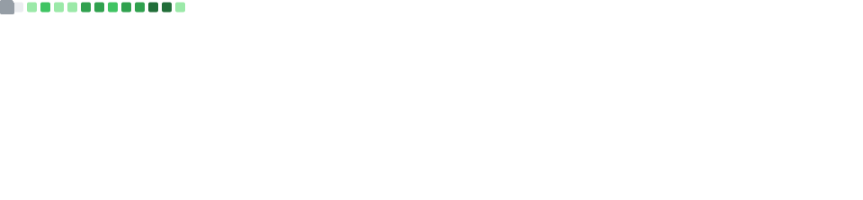
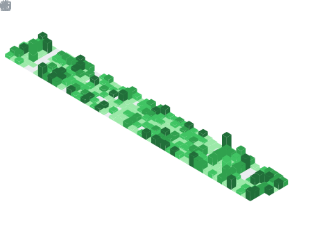

# Andrea Bozzo

Open source engineer building data platforms, developer tooling, and technical writing around Rust, Python, Go, and modern analytics systems.

These are my projects, contributions, and writings. For more about me, see the links below..

[Website](https://andreabozzo.github.io/AndreaBozzo/) | [Blog](https://andreabozzo.github.io/AndreaBozzo/blog/) | [LinkedIn](https://www.linkedin.com/in/andrea-bozzo-/) | [Email](mailto:andreabozzo92@gmail.com)

## Papers and companion repositories

- [uic2026-nephtys](https://github.com/AndreaBozzo/uic2026-nephtys) - companion repository for the IEEE UIC 2026 short paper on Nephtys, including the sensor simulator, demo scripts, benchmark automation, and LaTeX source.
- [scalcom2026-dataprof](https://github.com/AndreaBozzo/scalcom2026-dataprof) - IEEE ScalCom 2026 paper and benchmark suite comparing dataprof against interpreted Python profilers for scalable and sustainable edge AI telemetry profiling.

## Open source contributions

Contributions to the broader open source ecosystem beyond my own repositories.

> This section is updated automatically via GitHub Actions.

<!-- EXTERNAL_CONTRIBUTIONS:START -->

  
  
  

### 🔬 Data Ecosystem

  
  
  
  
  
  
  
  
  

### 🦀 Rust Tooling

  
  
  
  

### 🤖 AI/ML

  

### 🛠️ Infrastructure

  

### 📦 Other

  
  

<!-- EXTERNAL_CONTRIBUTIONS:END -->

## GitHub snapshot

  
  

  

