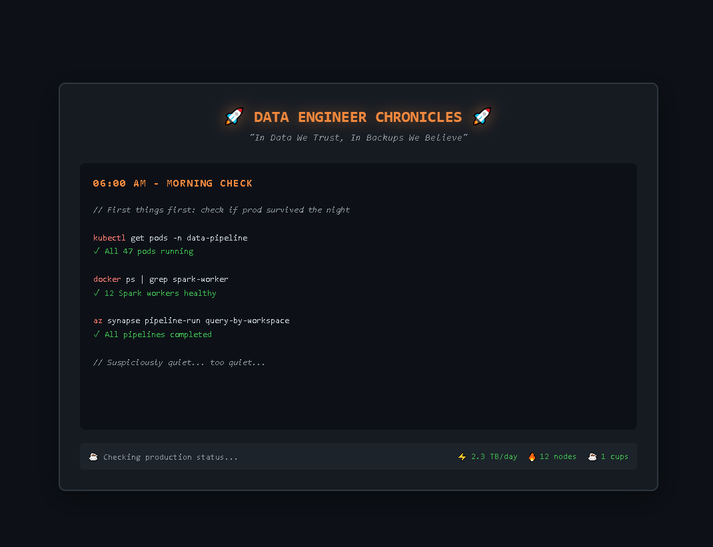

# 👋 Andrea Bozzo

<div align="center">
  <picture>
    <source media="(prefers-color-scheme: dark)" 
            srcset="./assets/animations/Animazione1.gif">
    <source media="(prefers-color-scheme: light)" 
            srcset="./assets/animations/Animazione1.gif">
    
  </picture>
</div>

<p align="center">
  <i>Actual footage from production (every single day)</i>
</p>

## 🌐 Professional Ecosystem

<div align="center">

### **🏠 [Professional Landing Page](https://andreabozzo.github.io/AndreaBozzo/) • 🎮 [Interactive Animation](https://andreabozzo.github.io/AndreaBozzo/assets/animations/data-engineer.html) • 📄 [Download CV](https://andreabozzo.github.io/AndreaBozzo/cv/andrea-bozzo-cv.html)**

</div>

<table>
<tr>
<td width="33%" align="center">

**🏠 Landing Page**
<br>
[**andreabozzo.github.io**](https://andreabozzo.github.io/AndreaBozzo/)
<br><br>
✨ Real-time GitHub metrics<br>
🎯 Professional showcase<br>
📱 Mobile-optimized<br>
⚡ Lighthouse 100/100

</td>
<td width="33%" align="center">

**🎮 Interactive Animation**
<br>
[**Data Engineer Chronicles**](https://andreabozzo.github.io/AndreaBozzo/assets/animations/data-engineer.html)
<br><br>
🎭 Day-in-the-life simulation<br>
🥚 Hidden easter eggs<br>
⌨️ Konami Code support<br>
📱 Touch-device optimized

</td>
<td width="33%" align="center">

**📄 Professional CV**
<br>
[**Interactive Resume**](https://andreabozzo.github.io/AndreaBozzo/cv/andrea-bozzo-cv.html)
<br><br>
🖨️ Print-ready PDF<br>
💼 Complete experience<br>
🎨 Matching design theme<br>
📊 Skills visualization

</td>
</tr>
</table>

<div align="center">

**🚀 [Explore the Full Experience →](https://andreabozzo.github.io/AndreaBozzo/)**

*Real-time data • Interactive elements • Professional design • Open source*

</div>

---

### 🎨 Want Your Own Digital Ecosystem?

**Fork this repository and customize!** Complete implementation available:
- 🏠 **Landing Page**: Modern design with real-time GitHub API integration
- 📁 **Interactive Animation**: `assets/animations/data-engineer.html` 
- 📄 **Professional CV**: Print-ready with matching branding
- ⚙️ **GitHub Pages Workflow**: `.github/workflows/pages.yml`
- 🎯 **Auto-updating Badges**: `.github/workflows/update-readme.yml`

<sub>💡 **Pro tip**: The entire ecosystem is designed to work together - landing page → animation → CV → projects. Customize the content but keep the flow!</sub>

## 📈 Live Production Metrics

<!-- BADGES:START -->


<!-- BADGES:END -->

<p align="center">
  <i>Last updated: automatically every morning • Status: 🔥 Everything is fine 🔥</i>
</p>

<p align="center">
  <strong>Data Engineer | Open Data Advocate | Analytics Pipeline Architect</strong><br>
  <em>"In Data We Trust, In Backups We Believe"</em><br>
  Transforming public data into accessible insights. Building scalable data solutions with open-source tools.
</p>

<p align="center">
  <a href="https://andreabozzo.github.io/AndreaBozzo/">
    
  </a>
  <a href="https://andreabozzo.github.io/AndreaBozzo/cv/andrea-bozzo-cv.html">
    
  </a>
  <a href="https://andreabozzo.github.io/AndreaBozzo/assets/animations/data-engineer.html">
    
  </a>
  <a href="https://github.com/sponsors/AndreaBozzo">
    
  </a>
  
</p>

<p align="center">
  <a href="#-professional-ecosystem">Digital Ecosystem</a> •
  <a href="#-featured-project">Featured Project</a> •
  <a href="#%EF%B8%8F-tech-stack">Tech Stack</a> •
  <a href="#-other-projects">Other Projects</a> •
  <a href="#-impact--achievements">Achievements</a> •
  <a href="#-lets-connect--collaborate">Connect</a>
</p>

---

## 🏆 Impact & Achievements

<div align="center">

<table>
<tr>
<td align="center" width="25%">
<h3>🚀</h3>
<h2>4+ Contributors</h2>
<p><strong>Osservatorio Platform</strong><br>Growing open-source community</p>
</td>
<td align="center" width="25%">
<h3>⚡</h3>
<h2>&lt;100ms</h2>
<p><strong>Query Performance</strong><br>Analytics response time</p>
</td>
<td align="center" width="25%">
<h3>📊</h3>
<h2>65% Coverage</h2>
<p><strong>Test Quality</strong><br>Production-ready code</p>
</td>
<td align="center" width="25%">
<h3>🌍</h3>
<h2>Open Source</h2>
<p><strong>Data Democracy</strong><br>Public data accessibility</p>
</td>
</tr>
</table>

### 🎯 **Core Mission: Democratizing Data Access**

*"Building bridges between complex public datasets and the people who need insights from them"*

**Recent Highlights:**
- ✅ **Osservatorio Platform**: Production-ready with growing contributor base
- ✅ **Performance Optimization**: Sub-100ms analytics queries achieved  
- ✅ **Community Impact**: 15+ public repositories, open-source advocate
- ✅ **Professional Development**: Modern tech stack, CI/CD, comprehensive testing

</div>

---


## 🔦 Featured Project

### 🔭 [Osservatorio](https://github.com/AndreaBozzo/Osservatorio) - *Open Data Analytics Platform*

<p align="center">
  
  
  
  
  
</p>

**Osservatorio** democratizes access to Italian statistical data through automated pipelines and intuitive visualizations. **Growing community with 4+ active contributors** and production-ready infrastructure.

#### ✨ Key Features
- **Robust ETL pipelines** for ISTAT data with automatic retries and circuit breakers
- **Interactive Streamlit dashboards** (React coming soon) for demographic and socio-economic analysis  
- **Multi-format export** (CSV, Excel, Parquet) for maximum interoperability
- **Contributor-friendly architecture** with complete documentation and 65% test coverage
- **Active community** with regular discussions and collaborative development

#### 🚀 Current Focus: Advanced Analytics Layer
Implementing hybrid persistence (DuckDB + SQLite to PostgreSQL) for <100ms analytics queries. **Seeking contributors for data modeling and performance optimization.** [Join the discussion →](https://github.com/AndreaBozzo/Osservatorio/discussions)

---

## 🛠️ Tech Stack

### The stack that keeps me awake at night:

| Category | Technologies | Status |
|----------|-------------|--------|
| **Data Processing** | Python, pandas, numpy, dbt-core | 🟢 Production Ready |
| **Storage & DB** | DuckDB, PostgreSQL, Parquet | 🟢 Optimized |
| **Analytics & BI** | streamlit, Power BI, Plotly, Excel | 🟢 Dashboard Heaven |
| **Orchestration** | Poetry, GitHub Actions | 🟡 Continuously Improving |
| **Philosophy** | No vendor lock-in, 100% reproducible | 🔥 Always On Fire |

### Core Technologies
```python
data_stack = {
    "orchestration": ["dbt-core", "Python 3.11+", "Poetry"],
    "storage": ["DuckDB", "PostgreSQL", "Parquet"],
    "analytics": ["pandas", "numpy", "streamlit"],
    "visualization": ["Power BI", "Plotly", "Excel"],
    "current_status": "🔥 Everything is fine 🔥"
}
```

### 📊 Skills Progress

#### Data Engineering


#### Analytics & BI


#### Cloud & DevOps


### Core Expertise
- **Data Modeling**: Multi-layer architectures (`staging → core → marts`)
- **Pipeline Design**: ETL/ELT with integrated validations and audit trails
- **API Integration**: SDMX, JSON, XML parsing from government sources
- **Performance**: Query optimization, caching strategies, async processing

---

## 📂 Other Projects

<table>
<tr>
<td width="25%">

### 🧊 [Mini-Lakehouse-Didattico](https://github.com/AndreaBozzo/Mini-Lakehouse-Didattico)
**Miniature Modern Data Stack**


- dbt + DuckDB for ultra-fast analytics
- Automated testing with `dbt-expectations`
- Production-ready template

</td>
<td width="25%">

### 🎯 [ATS-Research](https://github.com/AndreaBozzo/ATS-Research)
**ATS Parsing Optimization Research**


- Controlled A/B testing on 4 CV variants
- Multi-platform ATS parsing analysis
- Stealth techniques for hidden optimization

</td>
<td width="25%">

### 📊 [CruscottoPMI](https://github.com/AndreaBozzo/CruscottoPMI)
**Business Intelligence per PMI**


- Financial dashboards with Streamlit
- XBRL integration for financial statements
- Automated KPIs and what-if analysis

</td>
<td width="25%">

### 📈 [DashboardsBI-Excel](https://github.com/AndreaBozzo/DashboardsBI-Excel)
**Template Excel avanzati per BI**


- Dynamic dashboards with Power Query
- Financial calculations and what-if analysis
- Multi-sector parametric reports

</td>
</tr>
</table>

---

## 💡 Work Philosophy

> **"Public data belongs to everyone, it must be accessible to everyone"**

### Guiding Principles
- 🔍 **Transparency**: Every transformation traceable and documented
- 🚀 **Performance**: If it's not fast, it's not finished
- 🧪 **Quality**: Test first, debug later
- 🌍 **Openness**: No vendor lock-in, maximum portability

---

## 📊 GitHub Activity

<p align="center">
  
  
</p>

<p align="center">
  
</p>

**🏆 Quick Stats**: Focus on data engineering • Automated ETL pipelines • Open Source advocate • 85% Python, SQL, Power BI

---

## 🤝 Let's Connect & Collaborate

<p align="center">
  <a href="https://github.com/sponsors/AndreaBozzo">
    
  </a>
  <a href="https://github.com/AndreaBozzo/Osservatorio/discussions">
    
  </a>
  <a href="https://www.linkedin.com/in/andrea-bozzo-/">
    
  </a>
  <a href="mailto:andreabozzo92@gmail.com">
    
  </a>
</p>

### 💼 Open to Professional Opportunities:
- **Consulting** on data engineering and analytics architecture
- **Collaborations** on open data initiatives and public sector projects
- **Speaking engagements** on democratizing data access
- **Mentoring** junior data professionals

### 🎯 Currently Seeking:
- **Contributors** for Osservatorio project expansion
- **Data partnerships** with Italian public institutions
- **Open source maintainers** for knowledge sharing

---

## 🌟 Community & Open Source

<div align="center">

**Contributing to the Data Engineering Ecosystem**

<table>
<tr>
<td width="50%" align="center">

### 📚 **Knowledge Sharing**
- **15+ Public Repositories** with production-ready code
- **Comprehensive Documentation** for all projects
- **Best Practices** in data engineering and analytics
- **Open Source Templates** ready for community use

</td>
<td width="50%" align="center">

### 🤝 **Community Building** 
- **Active Discussions** on GitHub for technical collaboration
- **Mentoring** junior data professionals
- **Code Reviews** and constructive feedback
- **Public Data Advocacy** for transparency and access

</td>
</tr>
</table>

### 💡 **Philosophy in Action**
> *"The best data engineering solutions are the ones that empower others to build great things"*

**Community Impact:**
- 🔄 **Reproducible Workflows**: All projects include complete setup documentation
- 🎓 **Educational Resources**: Mini-lakehouse tutorials and examples
- 🌐 **Open Standards**: No vendor lock-in, maximum portability
- 🔧 **Production Ready**: Real-world solutions, not just demos

</div>

---

<div align="center">

## 🚀 **Ready to Explore?**

### **[Start with the Landing Page →](https://andreabozzo.github.io/AndreaBozzo/)**

<p align="center">
  <a href="https://andreabozzo.github.io/AndreaBozzo/">🏠 Professional Experience</a> • 
  <a href="https://andreabozzo.github.io/AndreaBozzo/cv/andrea-bozzo-cv.html">📄 Download CV</a> • 
  <a href="https://github.com/AndreaBozzo/Osservatorio">🔭 Featured Project</a> • 
  <a href="https://github.com/sponsors/AndreaBozzo">💎 Support Work</a>
</p>

---

*🌟 **Building the future of open data access** • 🎯 **One pipeline at a time** • 🤝 **Together with the community***

**Available for:** *Data Engineering Consulting • Open Source Collaboration • Technical Mentoring*

<sub>✨ **This entire ecosystem is open source** - Fork it, customize it, make it yours!</sub>

</div>
